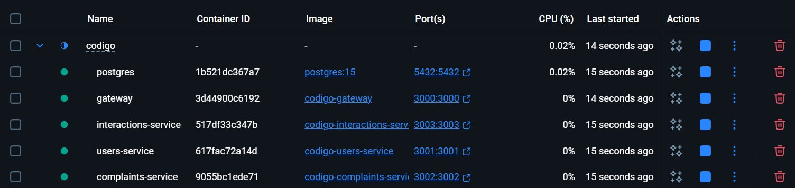
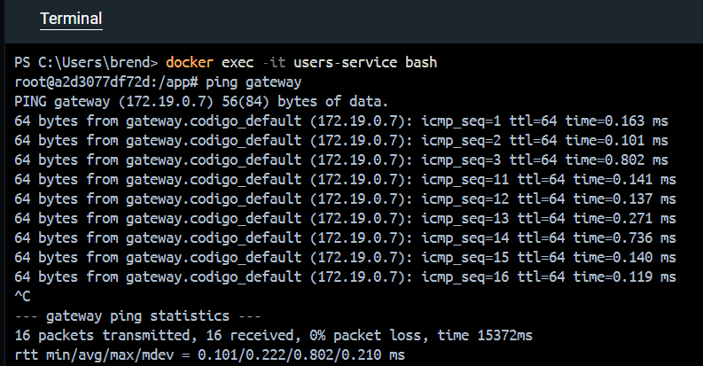

# Estrutura do Projeto

Projeto estruturado em "microsserviços", estre aspas pois eles compartilham banco.

- Pastas para cada microsservico
    - **users-service**: Gerenciamento de usuários (alunos e universidades), login, registro, perfis, autenticação (JWT) e autorização. Entidades do banco: Usuario (Aluno), Universidade, Credenciais.
    - **complaints-service**: Criação, visualização, edição e exclusão de reclamações. Gerenciamento do feed principal e busca de reclamações. Entidades do banco: Reclamacao, Categoria.
    - **interactions-service**: Gerenciamento de comentários em reclamações e respostas de universidades. Geração e entrega de notificações para usuários e universidades. Entidades do banco: Comentario, Notificacao.

- Gateway
    - Roteamento de requisições:
        - Quando uma requisição chega, o gateway decide para qual serviço ela deve ir.
        - Exemplo: /users → users-service, /complaints → complaints-service.
        - Autenticação e segurança centralizadas:
        - Você pode colocar filtros de segurança (como JWT, API keys ou autenticação básica) no gateway em vez de replicar em todos os serviços.

    - Balanceamento e abstração dos serviços:
        - Você pode expor uma única URL para o mundo externo, mesmo que existam vários serviços internos.
        - Facilita o desenvolvimento porque o frontend não precisa saber os detalhes de cada serviço ou porta.

    - Logging e monitoramento centralizados:
        - Todas as requisições passam pelo gateway, então é mais fácil registrar logs, métricas ou auditoria.
        - Analogia: O gateway é como a portaria de um prédio — ele recebe todos que chegam e direciona para o apartamento certo.

## Estrutura de pastas

```
codigo/
 ├── gateway/
 │    ├── src/
 │    │    ├── routes/
 │    │    │    └── index.js
 │    │    ├── middlewares/
 │    │    │    └── auth.js
 │    │    ├── controllers/
 │    │    │    └── gatewayController.js
 │    │    ├── services/
 │    │    │    └── proxyService.js
 │    │    ├── utils/
 │    │    │    └── logger.js
 │    │    └── app.js
 │    ├── server.js
 │    ├── package.json
 │    └── .env

 ├── users-service/
 │    ├── src/
 │    │    ├── routes/
 │    │    │    └── userRoutes.js
 │    │    ├── controllers/
 │    │    │    └── userController.js
 │    │    ├── services/
 │    │    │    └── userService.js
 │    │    ├── models/
 │    │    │    └── User.js
 │    │    ├── database/
 │    │    │    ├── connection.js
 │    │    │    └── migrations/
 │    │    ├── utils/
 │    │    │    └── responses.js
 │    │    └── app.js
 │    ├── server.js
 │    ├── package.json
 │    └── .env

 ├── complaints-service/
 │    ├── src/
 │    │    ├── routes/
 │    │    │    └── complaintRoutes.js
 │    │    ├── controllers/
 │    │    │    └── complaintController.js
 │    │    ├── services/
 │    │    │    └── complaintService.js
 │    │    ├── models/
 │    │    │    └── Complaint.js
 │    │    ├── database/
 │    │    │    └── connection.js
 │    │    ├── utils/
 │    │    │    └── responses.js
 │    │    └── app.js
 │    ├── server.js
 │    ├── package.json
 │    └── .env

 ├── interactions-service/
 │    ├── src/
 │    │    ├── routes/
 │    │    │    └── interactionRoutes.js
 │    │    ├── controllers/
 │    │    │    └── interactionController.js
 │    │    ├── services/
 │    │    │    └── interactionService.js
 │    │    ├── models/
 │    │    │    └── Interaction.js
 │    │    ├── database/
 │    │    │    └── connection.js
 │    │    ├── utils/
 │    │    │    └── responses.js
 │    │    └── app.js
 │    ├── server.js
 │    ├── package.json
 │    └── .env

 ├── Document -> documentação do projeto
 ├── docker-compose.yml
 └── frontend/
      └── (seu código atual)

```

```
gateway/
 ├── src/
 │    ├── routes/           → Rotas públicas e protegidas
 │    ├── middlewares/      → Autenticação, logs, validações
 │    ├── controllers/      → Lógica das rotas
 │    ├── services/         → Proxy para os microserviços
 │    ├── utils/            → Funções auxiliares
 │    └── app.js            → Configurações do Express
 ├── server.js              → Inicia o servidor
 └── .env

```

```
users-service/
 ├── src/
 │    ├── routes/           → userRoutes.js
 │    ├── controllers/      → userController.js
 │    ├── services/         → userService.js (regras de negócio)
 │    ├── models/           → User.js (schema/model)
 │    ├── database/         → conexão + migrations
 │    ├── utils/            → formatação de respostas
 │    └── app.js
 ├── server.js
 ├── package.json
 └── .env

```

## Para rodar

docker-compose up --build

## Microsserviços rodando



## Para testar conexão

- Entrar em um microsserviço (container): docker exec -it nome-do-container bash
- Dentro do container: ping nome-de-outro-container
- Se estiverem trocando pacotes de forma saudável: Tudo OK

